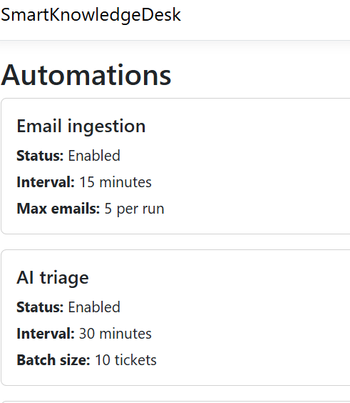
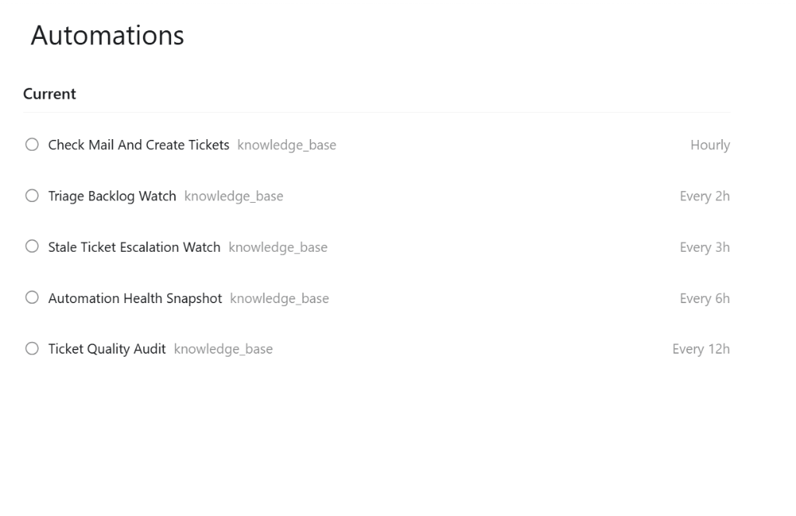
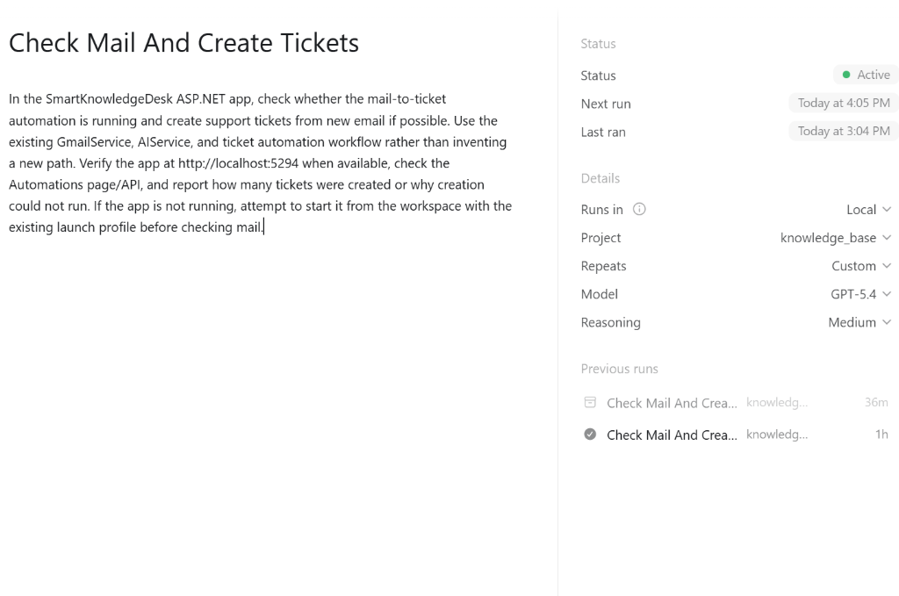

# SmartKnowledgeDesk 🧠⚡

SmartKnowledgeDesk is an automated ASP.NET Core ticket-triage and customer support platform. It integrates with Gmail and Groq AI (Llama/AI models) to ingest incoming emails, auto-triage them, suggest solutions, log automation runs, and escalate stale tickets.

---

## 🚀 Key Features

* **📧 Automated Email Ingestion (`EmailTicketIngestionService`):**
  * Periodically polls a Gmail inbox using IMAP.
  * Leverages Groq AI to analyze email body content.
  * Dynamically extracts `Category`, `Priority`, `SuggestedSolution`, and `NextAction` to create new structured support tickets.
  * Prevents duplicate ingestion of previously processed emails.

* **🤖 AI-Powered Ticket Triage (`TicketTriageAutomationService`):**
  * Scans for uncategorized tickets in the backlog.
  * Triage-assigns categories, priorities, suggested solutions, and next actions.

* **⏰ Stale Ticket Escalation (`StaleTicketEscalationService`):**
  * Automatically flags open, unresolved tickets that have been inactive for more than a configured timeframe (e.g., 24 hours).
  * Automatically escalates tickets and registers escalation events.

* **🔌 Extensible Plugin System:**
  * Uses a robust lifecycle event plugin model (`ITicketAutomationPlugin`).
  * **`AuditLogTicketPlugin`**: Records security and lifecycle audit events.
  * **`HighPriorityRoutingPlugin`**: Auto-assigns teams (e.g., "tier-3-support") and routes high-priority tickets.

* **📊 Live Automations Dashboard:**
  * View real-time status of active services.
  * Inspect execution counts, success/failure metrics, and recent activity logs.
  * Read full execution summary feeds directly from [automation-results.jsonl](file:///c:/Users/bisht/knowledge_base/SmartKnowledgeDesk/App_Data/automation-results.jsonl).

---

## 📷 Screenshots & Interface Preview

Here is a preview of the active automations and task schedules:

| 1. Automation Ingestion & Triage summary | 2. Scheduled Active Automations list |
|:---:|:---:|
|  |  |

### 3. Detailed View: Check Mail And Create Tickets


---

## 🛠️ Configuration (`appsettings.json`)

Configure the application in `SmartKnowledgeDesk/appsettings.json`. A template is provided in `appsettings.json.example`.

```json
{
  "ConnectionStrings": {
    "DefaultConnection": "Server=.;Database=SmartKnowledgeDB;Trusted_Connection=True;Encrypt=False;TrustServerCertificate=True;"
  },
  "Groq": {
    "ApiKey": "YOUR_GROQ_API_KEY"
  },
  "Gmail": {
    "Email": "your-email@gmail.com",
    "Password": "YOUR_GMAIL_APP_PASSWORD"
  },
  "Automation": {
    "EmailIngestion": {
      "Enabled": true,
      "IntervalMinutes": 15,
      "MaxEmailsPerRun": 5,
      "AgentName": "enterprise support AI agent"
    },
    "TicketTriage": {
      "Enabled": true,
      "IntervalMinutes": 30,
      "BatchSize": 10
    },
    "StaleTicketEscalation": {
      "Enabled": true,
      "IntervalMinutes": 60,
      "StaleAfterHours": 24
    }
  }
}
```

> [!NOTE]
> Gmail integration requires a Google Account **App Password** (16 characters) instead of your regular password.

---

## 💻 Running the Project Locally

### 1. Build and Run the App
Run the application specifying the port and disabling default launch profiles:
```powershell
cd c:\Users\bisht\knowledge_base\SmartKnowledgeDesk
dotnet run --no-launch-profile --urls http://127.0.0.1:5300
```

### 2. Access the Application
* **Dashboard / Main Interface:** [http://127.0.0.1:5300](http://127.0.0.1:5300)
* **Automations View:** [http://127.0.0.1:5300/Automations](http://127.0.0.1:5300/Automations)

---

## 📦 Project Architecture Highlights

* [Program.cs](file:///c:/Users/bisht/knowledge_base/SmartKnowledgeDesk/Program.cs) — Application startup, service dependency injection, background tasks, and plugin registrations.
* [AutomationsController.cs](file:///c:/Users/bisht/knowledge_base/SmartKnowledgeDesk/Controllers/AutomationsController.cs) — Processes background execution history and metrics for the web UI.
* [EmailTicketIngestionService.cs](file:///c:/Users/bisht/knowledge_base/SmartKnowledgeDesk/Services/EmailTicketIngestionService.cs) — Periodically checks email inbox and inserts tickets.
* [Ticket.cs](file:///c:/Users/bisht/knowledge_base/SmartKnowledgeDesk/Models/Ticket.cs) — Database model for support tickets.
* [AutomationEvent.cs](file:///c:/Users/bisht/knowledge_base/SmartKnowledgeDesk/Models/AutomationEvent.cs) — Stores individual run event logs in SQL Server.

---

## 🌐 GitHub Integration

This repository is synced with GitHub:
* **Remote Repository:** [https://github.com/YashikaBisht1/SmartKnowledgeDesk.git](https://github.com/YashikaBisht1/SmartKnowledgeDesk.git)
* **Branch:** `main`
